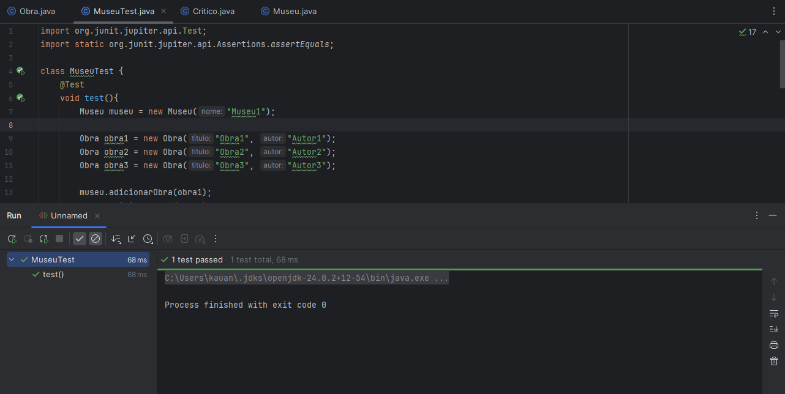

<h style="background-color: rgba(22, 44, 37, 1); padding: 10px; z-index: -1; border-radius: 20px; border: 2px solid rgba(0, 236, 146, 1); border-bottom: none; margin-left: 20px;">
1. Comentar com suas palavras o primeiro trecho do livro Software Engineering at Google, Oreilly.
</h>

      Os termos "Programação" e "Engenharia de Software" são comumente, erroneamente, usados para se referir a mesma coisa. Engenharia de Softare envolve programação, mas é uma área mais complexa, que abrange todas as etapas da criação de um software.
      A grande maioria das Engenharias, como a Mecânica, Civil, Aeronautica, e outras, envolvem a criação física de projetos que podemos tocar, como prédios, aviões e carros. Essa característica nos dá uma percepção muito maior do quão importante ou difícil as tarefas realizadas por aquela área pode ser. Já na Engenharia de Software, a ausência de toque não nos permite ter uma ideia real do quão grande e complexos os projetos podem ser. Além disso, outra caracterísca presente nas outras Engenharias é a rigorosidade nos processos, sendo ela muito mais forte ao compará-la com a flexibilidade da Engenharia de Software, que é muito recente e não desenvolveu processos tão rígidos. Um exemplo disso é a própria programação, que apresenta diversos caminhos para resolver o mesmo problema. Porém, com um maior envolvimento da sociedade com a tecnologia e a Engenharia de Software, se cria a necessidade de padrôes e convensões e, com o tempo, o regulamentação de processos é mais desenvolvida e uma maior rigosoridade é criada.

<h style="background-color: rgba(22, 44, 37, 1); padding: 10px; z-index: -1; border-radius: 20px; border: 2px solid rgba(0, 236, 146, 1); border-bottom: none; margin-left: 20px;">
      2. Comentar com suas palavras o segundo trecho do livro Software Engineering at Google, Oreilly.
</h>

Um ponto importante a se pensar é como o software se comporta ao longo do tempo e por quanto tempo ele se mantém operacional. Engenharia de Software é uma área que está em constante evolução e seus processos se tornam obsoletos com muita rapidez. Outra preocupação é em como o código se comporta para diferentes números de acessos. "Meu programa funciona com 100 pessoas usando? E com 1 milhão?". Algumas questões precisam ser levadas em consideração no processo de desenvolvimento de um software para tentar retardar essa obsolência e tornar os programas resilientes e escaláveis. Entre elas estão o desgaste pelo tempo, questões de adaptabilidade, escalabilidade, tolerância a falhas, 

<h style="background-color: rgba(22, 44, 37, 1); padding: 10px; z-index: -1; border-radius: 20px; border: 2px solid rgba(0, 236, 146, 1); border-bottom: none; margin-left: 20px;">
3. Listar e explicar 3 exemplos de tradeoffs
</h>

      <ul>
        <li>1. Performance vs. Manutenibilidade: Escolher usar C++ em vez de Python para um sistema que precisa processar muitas requisições por segundo deixa o programa mais rápido, mas também mais difícil de entender e modificar no futuro.</li>
        <li>2. Rapidez de Entrega vs. Qualidade: Criar uma API rapidamente em Node.js sem muita validação permite lançar o produto rápido, mas pode gerar erros e problemas de segurança que terão de ser corrigidos depois.</li>
        <li>3. Segurança vs. Usabilidade: Exigir autenticação multifator em todos os logins de um aplicativo financeiro aumenta a proteção, mas torna o acesso mais complicado para o usuário, podendo afastá-lo.</li>
      </ul>

<h style="background-color: rgba(22, 44, 37, 1); padding: 10px; z-index: -1; border-radius: 20px; border: 2px solid rgba(0, 236, 146, 1); border-bottom: none; margin-left: 20px;">
4. Diagrama de Classes UML
</h>

      

<h style="background-color: rgba(22, 44, 37, 1); padding: 10px; z-index: -1; border-radius: 20px; border: 2px solid rgba(0, 236, 146, 1); border-bottom: none; margin-left: 20px;">
5. Java
</h>

      public class Obra {

            private String titulo;
            private String autor;
            private List<Integer> avaliacoes = new ArrayList<>();
            private double avaliacoesMedia;

            // Construtor
            public Obra(String titulo, String autor) {
                  this.titulo = titulo;
                  this.autor = autor;
            }

            // Getters e Setters
            public String getTitulo() { return titulo; }
            public void setTitulo(String titulo) { this.titulo = titulo; }

            public String getAutor() { return autor; }
            public void setAutor(String autor) { this.autor = autor; }

            public List<Integer> getAvaliacoes() { return avaliacoes; }
            public void setAvaliacoes(List<Integer> avaliacoes) { this.avaliacoes = avaliacoes; }

            public double getAvaliacoesMedia() { return avaliacoesMedia; }
            public void setAvaliacoesMedia(double avaliacoesMedia) { this.avaliacoesMedia = avaliacoesMedia; }

            // Adiciona nova avaliação e atualiza média
            public void adicionarAvaliacao(int novaAvaliacao) {
                  avaliacoes.add(novaAvaliacao);
                  setAvaliacoesMedia(atualizarAvaliacoesMedia());
            }

            // Calcula a média das avaliações
            public double atualizarAvaliacoesMedia() {
                  double soma = 0.0;
                  for (int num : avaliacoes) {
                        soma += num;
                  }
                  return soma / avaliacoes.size();
            }
      }

    

      public class Critico {
            private String nome;
            
            public Critico(String nome){this.nome = nome;}

            public void avaliarObra(Obra obra, int avaliacao){obra.adicionarAvaliacao(avaliacao);}
      }

      public class Museu {
            private String nome;
            private List<Obra> obras= new ArrayList<>();
            private double estrelas = 0.0;

            public String getNome() {return nome;}
            public void setNome(String nome) {this.nome = nome;}

            public List<Obra> getObras() {return obras;}
            public void setObras(List<Obra> obras) {this.obras = obras;}

            public double getEstrelas() {return estrelas;}
            public void setEstrelas(double estrelas) {this.estrelas = estrelas;}

            public Museu(String nome) {this.nome = nome;}

            public void adicionarObra(Obra obra){obras.add(obra);}

            public void atualizarEstrelas(){
                  double avaliacoesMedia = this.obras.stream().mapToDouble(Obra::getAvaliacoesMedia).sum();
                  setEstrelas(avaliacoesMedia);
            }
      }

<h style="background-color: rgba(22, 44, 37, 1); padding: 10px; z-index: -1; border-radius: 20px; border: 2px solid rgba(0, 236, 146, 1); border-bottom: none; margin-left: 20px;">
6.Testes Automatizados
</h>

      import org.junit.jupiter.api.Test;
      import static org.junit.jupiter.api.Assertions.assertEquals;

      class MuseuTest {
            @Test
            void test(){
                  Museu museu = new Museu("Museu1");

                  Obra obra1 = new Obra("Obra1", "Autor1");
                  Obra obra2 = new Obra("Obra2", "Autor2");
                  Obra obra3 = new Obra("Obra3", "Autor3");

                  museu.adicionarObra(obra1);
                  museu.adicionarObra(obra2);
                  museu.adicionarObra(obra3);

                  Critico critico1 = new Critico("Critico1");
                  Critico critico2 = new Critico("Critico2");
                  Critico critico3 = new Critico("Critico3");

                  critico1.avaliarObra(obra1, 4);
                  critico1.avaliarObra(obra2, 1);
                  critico1.avaliarObra(obra3, 5);
                  critico2.avaliarObra(obra1, 4);
                  critico2.avaliarObra(obra2, 5);
                  critico2.avaliarObra(obra3, 5);
                  critico3.avaliarObra(obra1, 1);
                  critico3.avaliarObra(obra2, 2);
                  critico3.avaliarObra(obra3, 5);

                  museu.atualizarEstrelas();

                  assertEquals(3.0, obra1.getAvaliacoesMedia());
                  assertEquals(8.0/3, obra2.getAvaliacoesMedia());
                  assertEquals(5.0, obra3.getAvaliacoesMedia());
                  assertEquals(32.0/3, museu.getEstrelas());
            }
      }

